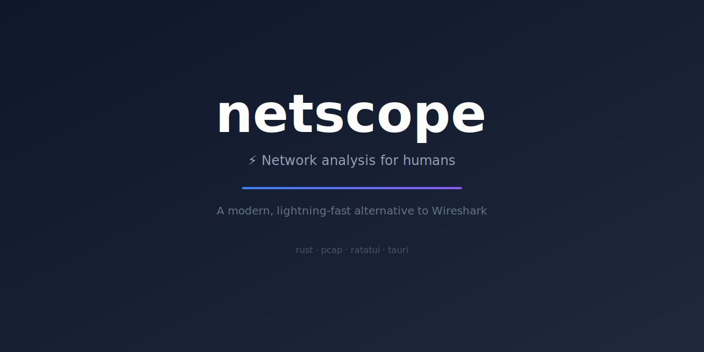

<p align="center">
  
</p>

<h1 align="center">netscope ⚡</h1>

<p align="center">
  <b>Network analysis for humans.</b> A modern, lightning-fast alternative to Wireshark.
  <br>
  One binary. Zero config. Beautiful by default.
</p>

<p align="center">
  <a href="#install"></a>
  
  
  
</p>

<p align="center">
  <a href="#features">Features</a> •
  <a href="#why-netscope">Why netscope?</a> •
  <a href="#install">Install</a> •
  <a href="#quick-start">Quick Start</a> •
  <a href="#keyboard-shortcuts">Keys</a> •
  <a href="#docs">Docs</a> •
  <a href="#contributing">Contributing</a>
</p>

<br>

> **📺 Demo GIF here** — drag a 15-second screen recording showing live capture with colored packets, tab switching, and the dashboard.

<br>

---

## Why netscope?

| | netscope | Wireshark |
|---|---|---|
| **Readability** | ✅ Shows `google.com → 142.250.74.46` | ❌ Raw hex dumps, cryptic flags |
| **Setup** | ✅ `cargo install netscope-tui` — done | ❌ 47 menus, 200 MB installer, 5 config dialogs |
| **Size** | ✅ ~5 MB single binary | ❌ ~200 MB installer + profiles + plugins |
| **Focus** | ✅ Just the signal, no noise | ❌ Everything including kitchen sink |
| **Speed** | ✅ 10k+ pkt/s, zero lag | ❌ Can freeze on large captures |

**netscope is to Wireshark what `bat` is to `cat`.** Same power, but actually pleasant to use.

---

## Features

- **🧠 Human-readable summaries** — DNS domains, TLS SNI hostnames, HTTP paths. Not hex.
- **🌐 Passive hostname resolution** — Watches DNS responses and shows `github.com:443` instead of a bare IP. No lookups of its own, zero added traffic.
- **🎯 Zero-config interface pick** — Skips loopback and virtual adapters (WAN Miniport, Hyper-V) and lands on your real Wi-Fi/Ethernet automatically.
- **🎨 Beautiful TUI** — Protocol-colored rows, dark theme, smooth layout. Ships with taste.
- **📊 Live dashboard** — Bandwidth, top talkers, protocol distribution. Updated in real time.
- **📋 DNS log view** — See every queried domain at a glance.
- **🔍 Smart filter** — Type anything — IP, protocol, domain — results update instantly.
- **🖥️ Headless mode** — Pipe-friendly `--json` output for scripts and integrations.
- **📂 Read/write pcap** — Analyze saved captures, save live ones for later.
- **⚡ Blazing fast** — Rust-native. 10k+ packets/sec without breaking a sweat.
- **🖥️ Desktop app** — Same engine, native GUI via Tauri. Bundles for Windows/macOS/Linux.

---

## Install

### From source (recommended)

```bash
cargo install netscope-tui
```

### Prerequisites

| Platform | Requirement |
|----------|-------------|
| **Windows** | [Npcap](https://npcap.com) (WinPcap-compatible mode) |
| **macOS** | No setup needed |
| **Linux** | `sudo setcap cap_net_raw,cap_net_admin+eip $(which netscope-tui)` (capture without root) |

### Build from source

```bash
git clone https://github.com/azzizefe/netscope.git
cd netscope
cargo build --release
./target/release/netscope-tui
```

---

## Quick Start

```bash
# Launch TUI (auto-selects interface)
netscope-tui

# Capture on specific interface with a BPF filter
netscope-tui -i eth0 -f "tcp port 443"

# Analyze a saved pcap file
netscope-tui -r capture.pcap

# Pipe JSON output to jq
netscope-tui -i eth0 --headless --json | jq '.summary'
```

---

## Usage

### CLI Options

```
Usage: netscope-tui [OPTIONS]

  -i, --interface <IFACE>    Interface to capture on
  -r, --read <FILE>          Read from a pcap file
  -w, --write <FILE>         Save capture to pcap file
  -f, --filter <BPF>         BPF filter (e.g. "tcp port 443")
  -D, --list-interfaces      List available interfaces
      --headless             Plain text output to stdout
      --json                 JSON Lines output (implies --headless)
  -h, --help                 Print help
```

### Keyboard Shortcuts

| Key | Action |
|-----|--------|
| `↑` / `↓` or `j` / `k` | Navigate packet list |
| `Enter` | Expand/collapse packet details |
| `Tab` / `Shift+Tab` | Switch views |
| *(any character)* | Filter packets (free text — type directly) |
| `Space` | Pause / resume capture |
| `h` | Toggle hex dump |
| `?` | Help overlay |
| `Esc` | Clear filter / close help |
| `q` | Quit |

### Views

| View | Description |
|------|-------------|
| **Packets** | Live packet stream with human-readable summaries |
| **Dashboard** | Real-time stats, bandwidth, protocol distribution, top talkers |
| **Connections** | Conversations grouped by flow — packets, bytes, direction, duration per connection |
| **DNS Log** | All DNS queries and responses in one place |

---

## Screenshots

> **📸 Insert screenshots here:**
> 1. TUI packet list with colored rows
> 2. Dashboard with bandwidth chart and protocol bar graph
> 3. DNS log view
> 4. Help overlay

<p align="center">
  <i>Screenshots coming soon. Run it yourself to see.</i>
</p>

---

## Docs

Full index: [docs/README.md](docs/README.md)

| Document | What it covers |
|----------|---------------|
| [Setup Guide](docs/setup.md) | Prerequisites, build instructions, troubleshooting |
| [TUI Guide](docs/tui.md) | CLI flags, views, colors, keyboard shortcuts, headless mode |
| [Filter Cookbook](docs/filters.md) | Ready-to-paste BPF filters for common tasks |
| [FAQ & Troubleshooting](docs/faq.md) | Common problems and their fixes |
| [Kullanım Kılavuzu (Türkçe)](docs/KULLANIM.md) | Kurulum, gereksinimler (Npcap vb.), tüm özellikler, sorun giderme |
| [Architecture](docs/architecture.md) | Crate layout, data flow, dispatch chain, CI/CD |
| [Core API](docs/core.md) | Packet, Protocol, CaptureEngine, StatsEngine, NameCache, dissectors |
| [Dissector Guide](docs/dissectors.md) | Summary conventions, dispatch logic, how to add |
| [Desktop Guide](docs/desktop.md) | Tauri commands, frontend, build instructions, icons |
| [CI/CD Guide](docs/ci-cd.md) | Pipeline details, release process, adding platforms |

---

## Project Structure

```
netscope/
├── crates/
│   ├── core/           Capture engine, protocol dissectors, models, stats
│   └── tui/            Terminal UI (ratatui + crossterm + clap)
├── desktop/
│   ├── frontend/       Desktop frontend (HTML/CSS/JS)
│   └── src-tauri/      Tauri 2 backend (Rust)
├── fixtures/           8 sample .pcap files for testing
├── docs/               Architecture, API, guides (7 files)
├── tools/gen-fixtures/ pcap generator (etherparse)
└── .github/workflows/  CI + Release pipelines
```

---

## Tech Stack

| Layer | Technology |
|-------|-----------|
| **Capture** | `pcap` crate (libpcap / Npcap) |
| **Packet parsing** | `etherparse` + custom dissectors |
| **DNS parsing** | `dns-parser` |
| **TUI** | `ratatui` + `crossterm` |
| **CLI** | `clap` |
| **Concurrency** | `crossbeam-channel` |
| **Desktop** | Tauri (vanilla HTML/CSS/JS) |

---

## Contributing

We welcome contributions! See [CONTRIBUTING.md](CONTRIBUTING.md) for guidelines.

- [Code of Conduct](CODE_OF_CONDUCT.md)
- [Bug reports](.github/ISSUE_TEMPLATE/bug_report.md)
- [Feature requests](.github/ISSUE_TEMPLATE/feature_request.md)

---

<p align="center">
  Built with ❤️ and 🦀
  <br>
  <a href="https://github.com/yourusername/netscope">GitHub</a> •
  <a href="https://crates.io/crates/netscope-tui">crates.io</a> •
  <a href="#netscope-">Back to top</a>
</p>
