# netscope — Senior-Level Sistem Değerlendirme Raporu

> **Tarih:** 31 Temmuz 2026  
> **Kapsam:** Tüm workspace crate'leri, desktop frontend, CI/CD, dokümantasyon, mimari  
> **Yöntem:** Statik kod analizi, yapısal inceleme, mimari değerlendirme

---

## 📊 Proje Özeti (Bir Bakışta)

| Metrik | Değer |
|---|---|
| **Toplam Rust LOC** | ~152.000 satır |
| **Core crate LOC** | ~132.000 satır (%87) |
| **Dissector dosya sayısı** | 501 ayrı `.rs` dosyası |
| **Registry'deki protokol** | ~2.531 (590 aktif dissect, 1.941 declared) |
| **Workspace crate sayısı** | 7 (core, tui, wasm, server, agent, desktop, gen-fixtures) |
| **Test sayısı** | ~2.397 Rust + 173 frontend (vitest) |
| **Frontend** | Vanilla HTML/CSS/JS (~314K `app.js`) |
| **Desktop framework** | Tauri v2 |
| **Minimum Rust** | 1.88 |

---

## ✅ Güçlü Yönler

### 1. Mimari Olgunluk — Paylaşılan Core Kütüphanesi

Projenin en güçlü kararı, tüm iş mantığının `netscope-core` içinde yaşaması ve tüm üst katmanların (TUI, Desktop, WASM, Agent) buna bağımlı olmasıdır. Bu klasik **"shared library" pattern**'i:

- Kod tekrarını ortadan kaldırıyor
- Protokol eklediğinizde **her platformda** otomatik çalışıyor
- WASM için `cfg(not(target_arch = "wasm32"))` ile temiz bir gating yapılmış

```
TUI ──┐
Desktop──┤
WASM ────┼──→ netscope-core ──→ libpcap/Npcap
Agent ───┤
Server ──┘
```

> **💡 Not:** Bu pattern, Go'daki `internal/` veya Python'daki monorepo SDK pattern'i ile aynı mantık — doğru tercih.

### 2. Protocol Registry Macro Sistemi

`crates/core/src/registry.rs` dosyasındaki `protocols!` macro'su, her protokolü **tek bir satırda** tanımlayıp display adı, renk, filtre token'ı, transport sınıfı ve eğitim blurb'unu otomatik üretiyor. Bu:

- **Compile-time** tutarlılık sağlıyor (eksik alan = derleme hatası)
- Eski 8-dosya düzenleme döngüsünü ortadan kaldırmış
- `Support::Dissected` vs `Support::Declared` ayrımı ile kullanıcıya yalan söylenmiyor

### 3. Gerçekçi Öz-Eleştiri Kültürü

Çok az açık kaynak projede şunları görürsünüz:

- **CRITICAL-ISSUES.md** — Projenin kendi bilinen kusurlarını dürüstçe belgeleyen, doğrulama komutlarıyla desteklenmiş bir dosya
- **UNTESTED.md** — "Test edemeyeceğimiz yollar" belgesi
- Kapatılan sorunların `~~strikethrough~~` ile işaretlenip tarihçenin korunması

Bu, **mühendislik olgunluğunun** bir göstergesi. Birçok kurumsal projede bile bu düzeyde transparency yok.

### 4. Zengin Özellik Seti (Wireshark'a Alternatif Olarak)

| Özellik | Durum | Not |
|---|---|---|
| 590 aktif protokol dissector | ✅ | Wireshark'ın ~3000'ine karşı iyi bir başlangıç |
| TLS 1.2/1.3 decryption | ✅ | SSLKEYLOGFILE desteği |
| JA3/JA4/JA3S fingerprinting | ✅ | Wireshark'ta plugin gerektirir |
| Pasif DNS çözümleme | ✅ | Sıfır ek trafik |
| Gerçek zamanlı firewall engelleme | ✅ | (Yalnız Windows) |
| SSH üzerinden uzak yakalama | ✅ | sshdump eşdeğeri |
| USB/Bluetooth/CAN yakalama | ✅ | IoT/OT için önemli |
| WASM display filter | ✅ | Tarayıcıda çalışan filter engine |
| Script console (JS) | ✅ | Wireshark'ın Lua'sına benzer |

### 5. Güvenlik Bilinçli Tasarım

`SECURITY.md`'deki threat model açık ve dürüst. Özellikle:

- Agent'ın **derlenmiş public key** ile imza doğrulaması (disk üzerinden değil)
- JWT secret'siz server başlatmama kararı
- Sahte capture backend'lerin silinmesi (#19) — "çalışıyormuş gibi yapma" reddedilmiş

---

## 🔴 Kritik Sorunlar ve Eksiklikler

### 1. `netscope-core` Monolith Anti-Pattern — "God Crate" Problemi

> ⚠️ **DİKKAT:** Core crate, 132.000 satırlık **tek bir kütüphane**. Bu, projenin en büyük mimari riskidir.

`lib.rs` dosyasında **75 modül** tanımlı. Bunlar arasında birbiriyle hiç ilişkisi olmayan endişeler var:

```
netscope-core/src/
├── capture.rs          (57 KB) — Paket yakalama motoru
├── dissectors.rs       (174 KB) — 5120 satır dispatch mantığı
├── registry.rs         (897 KB) — 25.570 satır protokol tablosu
├── education.rs        (685 KB) — Eğitim içeriği (!)
├── siem.rs             (46 KB) — SIEM entegrasyonu
├── alerting.rs         (51 KB) — Uyarı motoru
├── llm_analytics.rs    (47 KB) — LLM trafik analizi
├── pair_correlation.rs (47 KB) — İstatistiksel korelasyon
├── pqc_wizard.rs       (48 KB) — Post-quantum kripto wizard
├── notifications.rs    (31 KB) — Email/webhook bildirimleri
├── api_server.rs       (35 KB) — REST API sunucusu
└── ... 64 modül daha
```

**Sorunlar:**

| Problem | Etki |
|---|---|
| **Derleme süresi** | 132K satır her değişiklikte yeniden derlenir |
| **Bağımlılık sızıntısı** | `aes-gcm`, `rsa`, `lettre`, `rusqlite`, `maxminddb`, `rayon` — hepsi "core"da. TUI sadece paket çözümlemek istese bile SMTP kütüphanesi çekiyor |
| **WASM boyutu** | 20+ modül `cfg(wasm32)` ile kapatılmak zorunda — bu gating organik değil, kırılgan |
| **Single responsibility** | `education.rs` (685 KB!) bir eğitim içerik yönetim sistemi; bu bir ağ analiz kütüphanesine ait değil |
| **Test izolasyonu** | Tek bir modüldeki hata tüm core testlerini durduruyor |

**Önerilen Refactoring:**

```
crates/
├── netscope-protocol/     # Protocol enum, registry, dissectors
├── netscope-capture/      # libpcap sarmalama, pipeline, ring buffer
├── netscope-filter/       # BPF parser, display filter engine
├── netscope-analysis/     # Stats, flows, expert, alerting
├── netscope-security/     # TLS keylog, crypto, threat intel, SIEM
├── netscope-education/    # Education.rs content (685KB'lık içerik)
├── netscope-io/           # pcapng, formats, export
└── netscope-core/         # Thin facade that re-exports the above
```

### 2. 141 Dissector Modülü Dispatch'ten Erişilemiyor

`CRITICAL-ISSUES.md` madde #2: 141 dissector derleniyor ve kendi testleri geçiyor ama **hiçbir çağrı yolu yok**. Bu "ölü kod" değil, "tamamlanmamış entegrasyon" — daha kötüsü.

**Neden sadece "wiring" ile çözülemez:** Çoğunun tanıma imzası yok (magic byte / `looks_like_*` fonksiyonu). Porta bağlamak depoda 3 kez gerçek hataya yol açmış.

**Risk:** Bir kullanıcı "590 protokol desteği" iddiasıyla gelip, elindeki trafik 141 bağlanmamış protokollerden birine düşerse, "Unknown" görür. Bu, güven kaybına yol açar.

### 3. CI/CD `main` Branch'ında Kırmızı

Son 3 CI koşusu başarısız. Açık kaynak bir proje için ilk izlenim **kırmızı bir badge** olmamalı. README'deki CI badge'i potansiyel katkıda bulunanları caydırır.

### 4. Tek Dosyalık Frontend — `app.js` = 313 KB

`desktop/frontend/app.js` tek bir dosyada 313 KB JavaScript:

- Modül sistemi yok (ES modules kullanılıyor ama ana dosya monolitik)
- Bundle/minify yok
- Hot-reload geliştirme deneyimi zayıf
- Test edilebilirlik düşük (173 vitest testi var ama frontend logic'in çoğu bu tek dosyada)

### 5. `registry.rs` — 25.570 Satırlık Tek Dosya (897 KB)

Bu dosya, muhtemelen **Rust ekosistemindeki en büyük tekil kaynak dosyalardan biri**. Macro ile üretildiği için mantıksal olarak anlaşılabilir, ancak:

- IDE'ler bu dosyayı açarken yavaşlıyor
- Code review'lar pratik olarak imkansız
- Git blame anlamsızlaşıyor

**Çözüm:** Registry'yi bir build script (`build.rs`) ile bir CSV/TOML dosyasından üretmek. Böylece veri ve mantık ayrılır.

---

## 🟠 Yüksek Öncelikli Eksiklikler

### 6. Cross-Platform Parite Eksikliği

| Özellik | Windows | macOS | Linux |
|---|---|---|---|
| Canlı yakalama | ✅ | ✅ | ✅ |
| Firewall engelleme | ✅ | ❌ | ❌ |
| Service install (agent) | ✅ | ❌ | ❌ |
| Release binary | ✅ x64 | ⚠️ arm64 only | ✅ x64 |
| Code signing | ❌ | ❌ placeholder | N/A |
| CI test | ⚠️ | ⚠️ | ⚠️ |

macOS Intel (x86_64) kullanıcısı **hiçbir şey indiremiyor**. Apple Silicon kullanıcısı Gatekeeper duvarına çarpıyor. Linux'ta firewall engelleme yok.

### 7. Error Handling Stratejisi — `anyhow` Her Yerde

`anyhow::Result` bir **uygulama** hata tipidir, kütüphane hata tipi değildir. Tüm core'da `anyhow` kullanılması, tüketici crate'lerin hataları programatik olarak işleyememesine yol açar:

```rust
// Bugün — tüketici sadece string'e bakabilir
match engine.start() {
    Err(e) => eprintln!("{e}"),  // "permission denied" mi, "no interface" mi?
}

// Olması gereken — tüketici dallanabilir
match engine.start() {
    Err(CaptureError::PermissionDenied) => elevate_and_retry(),
    Err(CaptureError::NoInterface) => show_interface_picker(),
    _ => {}
}
```

### 8. `education.rs` — 685 KB Rust Dosyasında Eğitim İçeriği

Bu dosya, **hardcoded string** olarak tüm protokol açıklamalarını, quiz sorularını ve eğitim materyalini barındırıyor. Bu:

- Her değişiklikte tüm core'u yeniden derletiyor
- İçerik ile kod ayrımı yok — bir editörün/yazarın Rust bilmesi gerekiyor
- i18n (uluslararasılaştırma) imkansız
- ~685.000 byte salt metin, binary'ye gömülüyor

**Çözüm:** İçeriği `resources/education/` altında Markdown/YAML dosyalarına taşı, `include_str!` veya çalışma zamanında oku.

### 9. Bağımlılık Yönetimi Endişeleri

`crates/core/Cargo.toml` incelendiğinde:

| Bağımlılık | Neden Endişeli |
|---|---|
| `rusqlite` (bundled) | SQLite'ı C kaynaklarından derler — WASM dışında her build'de |
| `rsa` + `aes-gcm` + `chacha20poly1305` + `argon2` | Kripto kütüphaneleri "core"da — bu ayrı bir crate olmalı |
| `lettre` (SMTP) | Bir paket analiz kütüphanesinde SMTP client? |
| `ureq` | HTTP client core'da |
| `maxminddb` | GeoIP — isteğe bağlı olmalı (feature gate) |
| `rayon` | Paralel iteratörler — iyi ama her yerde mi kullanılıyor? |

**Etki:** `cargo build -p netscope-core` şu an ~120 transitive dependency çekiyor. Bir WASM build'inde bunların çoğu gereksiz.

### 10. `dissectors.rs` — 5.120 Satırlık Dispatch Mantığı

Ana `dissectors.rs` dosyası 174 KB. Bu dosyada:

- 501 dissector modülünün `pub mod` bildirimleri
- Dispatch chain (hangi dissector'ı çağıracağına karar veren mantık)
- Test yardımcıları
- Binding mantığı

Bu tek bir dosyada çok fazla sorumluluk. Dispatch chain'in ayrı bir `dispatch.rs` dosyasına taşınması gerekiyor.

---

## 🟡 Orta Öncelikli İyileştirmeler

### 11. Entegrasyon Testi Kapsamı Dar

Yalnızca `crates/core/tests/integration_test.rs` — tek dosya. Eksik senaryolar:

- TUI + core end-to-end (pcap okuma → TUI render)
- Desktop + core (Tauri komutu → paket analizi → UI yanıtı)
- Multi-interface capture
- Ring buffer gerçek zamanlı rotasyon
- Filter engine edge case'leri (unicode, uzun ifadeler)

### 12. Performans Profiling Eksikliği

3 benchmark var (`parse_throughput`, `filter_match`, `mem_usage`), bunlar iyi bir başlangıç. Eksikler:

- **Memory allocation profiling** — 100K paketlik bir capture'da bellek tüketimi nedir?
- **Flame graph** — Dissect pipeline'ında darboğaz nerede?
- **Latency percentiles** — P50/P95/P99 dissect süresi
- **CI'da benchmark regression** — Yeni commit'ler performansı bozduktan sonra fark edilmiyor

### 13. Observability — Loglama ve Metrik Altyapısı

`tracing` crate'i kullanılmıyor. Hata ayıklama için:

- `println!` / `eprintln!` yapısal değil
- Yapısal log (structured logging) yok
- Dağıtık izleme (distributed tracing) yok
- Agent ve Server arasında correlation ID yok

### 14. `RUST_MIN_STACK=134217728` (128 MB Stack)

`.cargo/config.toml`'da varsayılan thread stack boyutu **128 MB**'a çıkarılmış. Bu, bir veya birden fazla fonksiyonun stack'te çok fazla yer kapladığını gösteriyor — muhtemelen büyük `match` blokları veya deep recursion.

**Risk:** Bu, production'da memory baskısına yol açabilir. Root cause bulunup düzeltilmeli (genellikle büyük enum'ları `Box<>` ile heap'e taşımak yeterlidir).

---

## 🟢 Gelecek Yatırım Alanları

### 15. Plugin Sistemi (Lua Ötesi)

Mevcut `mlua` entegrasyonu isteğe bağlı ve iyi. Ancak gerçek bir plugin sistemi için:

```
~/.config/netscope/plugins/
├── my-custom-dissector/
│   ├── plugin.toml     # metadata
│   └── dissect.lua     # mantık
└── corporate-filter/
    ├── plugin.toml
    └── filter.wasm     # WASM plugin
```

- **WASM plugin'leri** — Güvenli, sandboxed, herhangi bir dilde yazılabilir
- **Plugin marketplace** — Topluluk katkısını kolaylaştırır
- **Dissector hot-reload** — Yeniden derleme gerektirmeden dissector güncelleme

### 16. QUIC ve HTTP/3 Desteği Derinleştirme

README'de QUIC "590 protokol" listesinde yer alıyor, ancak QUIC decryption ve HTTP/3 tam parsing modern web analizinin olmazsa olmazı:

- Chrome/Firefox'un %40+ trafiği QUIC üzerinden
- `SSLKEYLOGFILE` QUIC için de çalışıyor ama netscope'un bunu destekleyip desteklemediği belirsiz
- HTTP/3 (QPACK header compression) dissect derinliği belirsiz

### 17. Streaming / Large Capture Optimizasyonu

`ConnectionInfo` struct'ında `packets: Vec<Packet>` — tüm paketler bellekte tutuluyor. 10M+ paketlik bir capture'da bu OOM'a yol açar.

**Çözüm önerileri:**
- Disk-backed packet store (mmap veya SQLite)
- Sliding window — son N paket bellekte, gerisi diskette
- Lazy loading — paket detayı ancak kullanıcı tıkladığında yüklenir

### 18. Automated Security Scanning

- **`cargo audit`** CI'da yok — bilinen CVE'li bağımlılıklar kontrol edilmiyor
- **Fuzzing** yok — AFL/libFuzzer ile dissector'ları fuzz'lamak, memory safety açıkları bulur
- Untrusted input parsing yapan her dissector, fuzzing hedefi olmalı

### 19. Telemetry ve Usage Analytics (Opsiyonel, Opt-in)

Açık kaynak bir araç için kullanıcı davranışını anlamak kritik:

- Hangi protokoller en çok görülüyor?
- Hangi özellikler kullanılmıyor?
- Crash raporları (minidump)

Tüm bunlar **opt-in** ve **şeffaf** olmalı (Sentry, PostHog gibi araçlarla).

---

## 🧬 Teknik Borç Haritası

```mermaid
graph TD
    A["🔴 God Crate<br/>(core = 132K LOC)"] --> B["Uzun derleme süreleri"]
    A --> C["Bağımlılık şişkinliği"]
    A --> D["Test izolasyonu yok"]
    
    E["🔴 141 Bağlanmamış<br/>Dissector"] --> F["Kullanıcı güven kaybı"]
    E --> G["Ölü kod bakım yükü"]
    
    H["🟠 CI Kırmızı"] --> I["Contributor caydırıcı"]
    H --> J["Regression tespiti yok"]
    
    K["🟠 313K app.js"] --> L["Frontend ölçeklenemez"]
    K --> M["Performance sorunları"]
    
    N["🟠 128MB Stack"] --> O["Memory baskısı"]
    N --> P["Root cause bilinmiyor"]
    
    Q["🟡 anyhow her yerde"] --> R["Programatik hata<br/>işleme yok"]
    
    S["🟡 education.rs 685K"] --> T["Derleme süresi"]
    S --> U["i18n imkansız"]
    
    style A fill:#ef4444,stroke:#991b1b,color:#fff
    style E fill:#ef4444,stroke:#991b1b,color:#fff
    style H fill:#f97316,stroke:#c2410c,color:#fff
    style K fill:#f97316,stroke:#c2410c,color:#fff
    style N fill:#f97316,stroke:#c2410c,color:#fff
    style Q fill:#eab308,stroke:#a16207,color:#000
    style S fill:#eab308,stroke:#a16207,color:#000
```



---

## 📋 Önerilen Öncelikli Eylem Planı

### Faz 0 — Acil (Bu Hafta)

| # | Eylem | Etki |
|---|---|---|
| 1 | CI'ı yeşile çevir — local HEAD'i push et | İlk izlenim |
| 2 | Git geçmişinden npcap-sdk + binary'leri temizle | Lisans riski |
| 3 | `cargo audit` CI job'ını ekle | Güvenlik |

### Faz 1 — Kısa Vade (1-2 Hafta)

| # | Eylem | Etki |
|---|---|---|
| 4 | `education.rs` içeriğini harici dosyalara taşı | -685KB derleme, i18n kapısı |
| 5 | `registry.rs`'yi build script ile üret | IDE performansı, review kolaylığı |
| 6 | macOS universal binary + notarization | Platform paritesi |

### Faz 2 — Orta Vade (1-2 Ay)

| # | Eylem | Etki |
|---|---|---|
| 7 | Core crate'i 4-5 alt crate'e böl | Derleme süresi, sorumluluk ayrımı |
| 8 | Custom error types (anyhow → thiserror) | Tüketici ergonomisi |
| 9 | Frontend modülerleştirme (ES modules / Svelte) | Geliştirme deneyimi |
| 10 | Fuzzing altyapısı (cargo-fuzz) | Güvenlik |

### Faz 3 — Uzun Vade (3-6 Ay)

| # | Eylem | Etki |
|---|---|---|
| 11 | Disk-backed packet store | Büyük capture desteği |
| 12 | WASM plugin sistemi | Topluluk genişlemesi |
| 13 | `tracing` entegrasyonu | Observability |
| 14 | QUIC/HTTP/3 derinleştirme | Modern web analizi |

---

## 🏆 Genel Değerlendirme

### Not: **B+ / İyi-Çok İyi Arası**

| Kategori | Puan | Yorum |
|---|---|---|
| **Mimari** | 7/10 | Core monolith sorunu dışında sağlam katmanlama |
| **Kod Kalitesi** | 8/10 | Clippy sıfır uyarı, fmt temiz, iyi dökümante |
| **Test Kapsamı** | 7/10 | 2.400+ test iyi, entegrasyon testleri zayıf |
| **Güvenlik** | 7/10 | Bilinçli tasarım, fuzzing eksik |
| **Dokümantasyon** | 9/10 | 14+ doküman, Türkçe kılavuz, dürüst kusur belgeleri |
| **CI/CD** | 5/10 | Pipeline var ama kırmızı, signing yok |
| **Ölçeklenebilirlik** | 5/10 | In-memory packet store, 128MB stack |
| **DevEx** | 6/10 | Frontend DX zayıf, build süresi uzun |
| **Özellik Zenginliği** | 9/10 | Wireshark'a gerçekçi bir alternatif |
| **Topluluk Hazırlığı** | 6/10 | CI kırmızı, git history kirli |

### Bir Cümlede

> **netscope, etkileyici bir özellik seti ve dürüst bir mühendislik kültürüne sahip, ancak "monolithic core" teknik borcu ve CI/platform paritesi sorunları çözülmeden 1.0'a gidemeyecek bir proje.**

Projenin en büyük riski, özellik ekleme hızının mimari iyileştirme hızını aşması — yani **feature velocity > architecture velocity** durumu. Her yeni dissector, her yeni analiz modülü, `netscope-core`'un 132K satırına birkaç bin satır daha ekliyor ve derleme süresini, test izolasyonunu ve geliştirici deneyimini bir adım daha kötüleştiriyor.

Çözüm basit ama acı verici: **dur, böl, sonra devam et.**

---

> **ÖNEMLİ:** Bu rapor, projeyi küçümsemek için değil, **1.0 release öncesi** mühendislik olgunluğunu artırmak için yazılmıştır. Projenin güçlü yönleri (özellikle registry macro sistemi, güvenlik bilinçli tasarım ve dürüst dokümantasyon kültürü) birçok kurumsal projeden üstündür.
