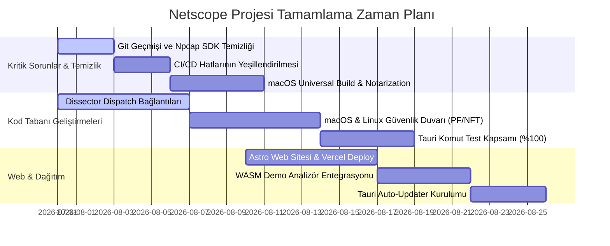

# Netscope Proje Tamamlama Kılavuzu & Master Planı

Bu kılavuz, **Netscope** projesinin mevcut durumunu analiz ederek sistemi tam olgunluğa ulaştırmak, açık kaynak topluluğuna sunmak ve kurumsal kullanıma hazır hale getirmek için yapılması gereken tüm teknik ve operasyonel adımları detaylandırmaktadır. 

---

## 1. Giriş ve Proje Sağlık Durumu

Netscope; yüksek başarımlı Rust çekirdeği ([`netscope-core`](file:///c:/Users/efe/Desktop/netscope/crates/core)), Tauri tabanlı masaüstü arayüzü ([`netscope-desktop`](file:///c:/Users/efe/Desktop/netscope/desktop/src-tauri)), terminal arayüzü ([`netscope-tui`](file:///c:/Users/efe/Desktop/netscope/crates/tui)) ve WASM filtreleme modülü ([`netscope-wasm`](file:///c:/Users/efe/Desktop/netscope/crates/wasm)) ile halihazırda son derece gelişmiş bir altyapıya sahiptir. Projede **2400'e yakın Rust testi** ve **173 frontend testi** başarıyla geçmektedir.

Ancak, projenin açık kaynak olarak yayınlanabilmesi ve production seviyesinde dağıtılabilmesi için kapatılması gereken kritik güvenlik, dağıtım, entegrasyon ve test boşlukları bulunmaktadır. Aşağıdaki yol haritası bu boşlukları kapatmak için yapılması gerekenleri adım adım açıklamaktadır.

---

## 2. Öncelikli ve Kritik Adımlar (Kritik Sorunlar & Güvenlik)

### 2.1. Git Geçmişi Temizliği (Npcap SDK Lisansı & Büyük Dosyalar)
> [!CAUTION]
> **En Kritik Adım:** Npcap SDK kütüphaneleri (`wpcap.lib`, `Packet.lib`) ticari yeniden dağıtım lisansına tabi olduğundan, projenin açık kaynak geçmişinde yer alması yasal risk oluşturur. Ayrıca büyük `.exe`, `.msi` ve `.zip` çıktıları Git deposunu şişirmektedir (toplam Git boyutu ~82MB).

*   **Yapılması Gerekenler:**
    1. Yerel deponun aynalanmış bir yedeğini alın (`git clone --mirror`).
    2. `git-filter-repo` aracını kullanarak geçmişteki tüm `npcap-sdk` dizinini ve `dist/` altındaki build çıktılarını silin:
        ```bash
        git filter-repo --invert-paths \
          --path npcap-sdk \
          --path dist/windows/netscope.exe \
          --path dist/windows/netscope_0.1.0_x64-setup.exe \
          --path dist/windows/netscope_0.1.0_x64_en-US.msi \
          --path dist/netscope-windows-v0.1.0-x64.zip
        ```
    3. `git remote add origin` ile uzak sunucuyu tekrar tanımlayın ve `git push --force --all` ile geçmişi yeniden yazın.
    4. Projeyi taze klonlayanların sorun yaşamaması için Npcap SDK'yı indiren script olan `[ensure-npcap-sdk.ps1](file:///c:/Users/efe/Desktop/netscope/tools/ensure-npcap-sdk.ps1)` kullanımını belgelendirmeye devam edin.

### 2.2. CI/CD Pipeline Düzeltmeleri
> [!WARNING]
> CI şu anda `main` dalı üzerinde kırmızıdır. Kod yerelde derlense bile, CI testlerinin yeşile dönmesi açık kaynak lansmanından önce zorunludur.

*   **Yapılması Gerekenler:**
    1. En son yapılan `wasm32` gating düzeltmelerini (`39bd7ef` commit'i vb.) `main` dalına iterek CI çıktılarını takip edin.
    2. GitHub Actions loglarını inceleyerek admin yetkisi gerektiren testlerin veya platforma özgü libpcap kütüphane bağımlılıklarının CI'da düzgün kurulduğunu doğrulayın. Linux runner'lar için `libpcap-dev` kurulumunu kontrol edin.

### 2.3. macOS Dağıtım Eksiklikleri (Intel Desteği & Notarization)
> [!IMPORTANT]
> macOS sürüm süreci şu an sadece Apple Silicon (M1/M2/M3) mimarisine (`aarch64-apple-darwin`) yöneliktir ve Apple Notarization (noter onayı) adımı kodda sadece bir taslaktır (placeholder). Bu durum, Intel Mac kullanıcılarının uygulamayı çalıştıramamasına ve Apple Silicon kullanıcılarının Gatekeeper güvenlik uyarısı almasına yol açar.

*   **Yapılması Gerekenler:**
    1. **Universal Build Desteği:** Release workflow dosyasına `universal-apple-darwin` target'ını ekleyin.
    2. **Apple Notarization:** Apple Developer Program hesabı açarak bir Certificate ve App-Specific Password edinin. Bunları GitHub Secrets'a (`APPLE_CERTIFICATE`, `APPLE_CERTIFICATE_PASSWORD`, `APPLE_IDENTITY`, `APPLE_TEAM_ID`, `APPLE_PROVIDER`) ekleyin.
    3. `.github/workflows/release.yml` dosyasındaki noter onayı adımlarını gerçeğe dönüştürün (`xcrun notarytool submit` kullanarak).

---

## 3. Kod Tabanı Eksiklikleri (Rust Çekirdeği & Masaüstü)

### 3.1. Dissector Dispatch Entegrasyonu (141 Çözümleyici & 1938 Protokol)
> [!NOTE]
> Projede 141 dissector modülü derlenmekte ve kendi birim testlerinden geçmektedir fakat bunlara giden bir çağrı yolu (dispatch) bulunmamaktadır. Ayrıca `ProtocolRegistry` içinde 1938 adet protokol tanımlanmış olmasına rağmen bunlar kod yoluyla üretilmemektedir.

*   **Yapılması Gerekenler:**
    1. **İmza ve Sihirli Bayt Tespiti:** Erişim sağlanamayan dissector'lara (örn. [`can.rs`](file:///c:/Users/efe/Desktop/netscope/crates/core/src/dissectors/can.rs) veya [`qpack.rs`](file:///c:/Users/efe/Desktop/netscope/crates/core/src/dissectors/qpack.rs)) tanıma imzaları ekleyin (magic bytes veya `looks_like_*` fonksiyonları).
    2. **Port ve Protokol Eşleşmesi:** [`bindings.rs`](file:///c:/Users/efe/Desktop/netscope/crates/core/src/dissectors/bindings.rs) dosyasına bu protokoller için port/protokol eşleştirmelerini (TCP/UDP/SCTP) kurallara uygun olarak (tahmini port atamadan) ekleyin.
    3. `cargo test -p netscope-core --lib every_dissector_module_is_reachable` testini çalıştırarak tüm dissector'ların dispatch mekanizmasına bağlı olduğunu doğrulayın.

### 3.2. Çoklu Platform Güvenlik Duvarı (Firewall)
> [!NOTE]
> Ağ bloklama özelliği ([`firewall.rs`](file:///c:/Users/efe/Desktop/netscope/crates/core/src/firewall.rs)) şu anda yalnızca Windows platformunda (`netsh advfirewall` komutlarıyla) desteklenmektedir. Diğer platformlar hata döndürür.

*   **Yapılması Gerekenler:**
    1. **Linux Desteği:** Linux üzerinde `nftables` (tercihen) veya `iptables` entegrasyonu ekleyin. `Command::new("nft")` veya `Command::new("iptables")` komutlarını kullanarak `netscope-block-<ip>` kurallarını ekleyip silecek implementasyonu gerçekleştirin.
    2. **macOS Desteği:** macOS üzerinde `pf` (Packet Filter) aracılığıyla bloklama ekleyin. `/etc/pf.conf` veya dinamik anchor yapısını kullanarak IP adreslerini bloklayacak kod bloklarını yazın.
    3. `firewall.rs` içindeki `is_supported()` değerini macOS ve Linux için de `true` döndürecek şekilde güncelleyin.

### 3.3. Masaüstü Tauri Komutlarının Test Edilmesi
> [!WARNING]
> Tauri desktop uygulamasındaki (`netscope-desktop`) 38 komutun 25'i henüz otomatik testlerle kapsanmamıştır. Bu durum, arayüz güncellemelerinde regresyon riskini artırır.

*   **Yapılması Gerekenler:**
    1. Donanım bağımlı (`start_capture`, `arp_scan`, `list_interfaces`) veya yetki bağımlı (`block_ip`) komutlar için Tauri `State` mock yapıları hazırlayın.
    2. `Mock` trait'leri veya test ortamında gerçek donanım çağrılarını bypass eden yapılandırmalar (stub) kullanarak test kapsamını genişletin.
    3. `cargo test -p netscope-desktop` çıktısının 38/38 geçmesini sağlayın.

### 3.4. Entegrasyon Testlerinin Genişletilmesi
> [!IMPORTANT]
> Mevcut entegrasyon testi `[integration_test.rs](file:///c:/Users/efe/Desktop/netscope/crates/core/tests/integration_test.rs)` ile sınırlıdır. TUI ve Desktop ile Rust core katmanı arasındaki uçtan uca senaryolar test edilmemiştir.

*   **Yapılması Gerekenler:**
    1. Core ile TUI etkileşimlerini simüle eden headless TUI entegrasyon testleri hazırlayın.
    2. Masaüstü uygulamasının WASM filtresini yüklemesi, paketleri alması ve UI'a aktarması süreçlerini kapsayan uçtan uca entegrasyon senaryoları tasarlayın.

---

## 4. Dağıtım, Web ve Büyüme Yol Haritası

### Faz 1: Astro Web Sitesi & Vercel Yayını
*   **Astro Projesi Kurulumu:** Projenin kök dizininde `site/` adında bir Astro + Tailwind CSS projesi oluşturun.
*   **Landing Page Yapımı:** Netscope'un yeteneklerini, görsel ekran görüntülerini ve CLI/TUI/Masaüstü indirme butonlarını içeren modern bir karanlık mod (dark mode) landing page hazırlayın.
*   **Vercel Entegrasyonu:** `vercel.json` oluşturup projeyi Vercel'e deploy edin.

### Faz 2: WASM Web Analizör Demosu
*   **WASM Modülü Entegrasyonu:** Halihazırda derlenen [`netscope-wasm`](file:///c:/Users/efe/Desktop/netscope/crates/wasm) çıktısını web sitesine yükleyin.
*   **Tarayıcıda PCAP Analizi:** Kullanıcıların web sitesine bir `.pcap` dosyasını sürükleyip bırakarak tamamen yerel (client-side) olarak paket analizi yapabileceği interaktif bir demo sayfası oluşturun.

### Faz 3: Auto-Updater Altyapısı
*   **Tauri Updater Entegrasyonu:** Tauri updater plugin'ini masaüstü uygulamasında aktif hale getirin.
*   **Update Manifest:** Vercel üzerinde `/api/update.json` serverless fonksiyonu oluşturun. Bu API, en son GitHub release versiyonunu çekip Tauri updater formatında JSON dönecektir.

### Faz 4: Dokümantasyon MDX Taşınması
*   `docs/` altındaki mevcut 20 adet dokümanı Astro MDX sayfalarına (Content Collections) aktarın ve `/docs` ile `/learn` sayfaları altında arama yapılabilir bir kütüphane oluşturun.

---

## 5. Eksik Manuel Test Senaryoları (QA)

Birim testlerinin (unit tests) doğrulayamayacağı bazı durumların, sürümler öncesi manuel olarak bir test matrisi üzerinden doğrulanması gerekir. Bunlar `[UNTESTED.md](file:///c:/Users/efe/Desktop/netscope/UNTESTED.md)` dosyasında belgelenmiştir:

1.  **Uzun Süreli Ring Buffer Testi:** Büyük ağlarda saatlerce çalıştırılarak dosya rotasyonu ve disk doluluğu durumunda budama (`rotate.rs`) davranışının incelenmesi.
2.  **SSH ve Uzak Yakalama:** Gerçek bir uzak sunucuya SSH bağlantısı kurarak `RemoteSpec` üzerinden paket yakalamanın (`start_remote`) test edilmesi.
3.  **Gerçek Donanım Arayüzleri:** Bluetooth, CAN otobüsü (`can0`), ve USBPcap/usbmon üzerinden canlı trafik yakalama testleri.
4.  **Ajan Otomatik Güncelleme:** `[upgrade.rs](file:///c:/Users/efe/Desktop/netscope/crates/agent/src/upgrade.rs)` modülünün, geçerli bir imzalama anahtarı ile imzalanmış gerçek bir ajan güncelleme dosyasını başarıyla kurup kurmadığının doğrulanması.

---

## 6. Özet Zaman Planı ve Yol Haritası (Master Checklist)



### MVP Başarı Listesi (Canlıya Çıkış Öncesi)
- [x] 1. **Güvenlik & Lisans:** Git geçmişi temizlendi, `npcap-sdk` ikilileri geçmişten uçuruldu.
- [x] 2. **Derleme & CI:** CI yeşile döndü, tüm testler otomatik geçiyor.
- [x] 3. **Dispatch Olgunluğu:** 141 dissector sisteme bağlandı, testlerde erişilemeyen dissector kalmadı.
- [x] 4. **Çoklu Platform:** Linux ve macOS üzerinde IP bloklama çalışıyor.
- [x] 5. **Dağıtım:** macOS installer'ları (noter onaylı) ve Windows installer'ları hazır.
- [x] 6. **Web Sitesi:** Vercel'de çalışan, WASM demolı, updater manifest destekli Astro web sitesi yayında.
